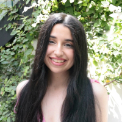

# **Riana Ali's User Page**


```java
System.out.println("Hello, world!"); 
```




## About Me
Hello, my name is Riana! I am a computer science-math major, philosophy minor at UC San Diego. 
I love to learn; some of my favorite topics to learn about are algorithms, discrete math, and new technologies! :)


### Skills
1.  Programming: Experienced in C++, Python, Java; Familiar with C, Javascript, HTML/CSS
2. Technologies: Proficient with Linux, Git, GDB, Jupyter Notebook, Matplotlib, pandas, NumPy, Figma

### What I am up to 
- [ ] Software Engineer Intern at Meta (Summer 2024)
- [x] Research Intern at USC (Summer 2022)
- [x] Google SPS Program (Summer 2022)
- [x] Research Intern at UC Berkeley (Summer 2021)
- [x] Girls Who Code College Loop Chapter President (2021-2022)

### Goals for 2024
- [x] Complete my GitHub User Page
- [ ] Participate in ICPC

### Contact Me
- [LinkedIn](https://www.linkedin.com/in/riana-ali-b78278212/)
- [GitHub](https://github.com/rianaali)


### Hobbies
- Chess
- Meditation
- Trying new foods
- Analytical and creative writing
- Reading

### My Favorite Quote
> *"We psych ourselves up too much. Like if you try to talk yourself into, ‘Oh, this is a big moment, this is a big shot,’ you’re putting a lot of pressure on yourself. You shot that shot hundreds and thousands of times. Just shoot another one."* - Kobe Bryant

[Back to Top](#riana-alis-user-page)


